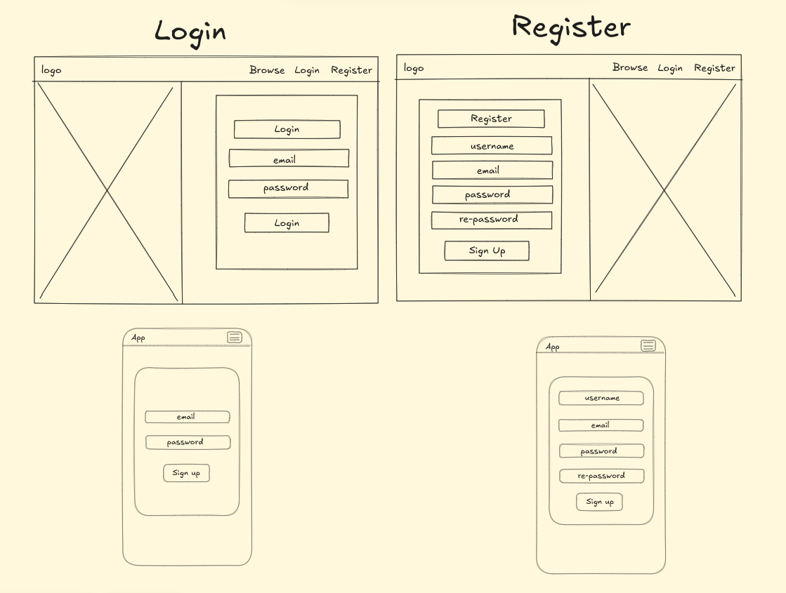
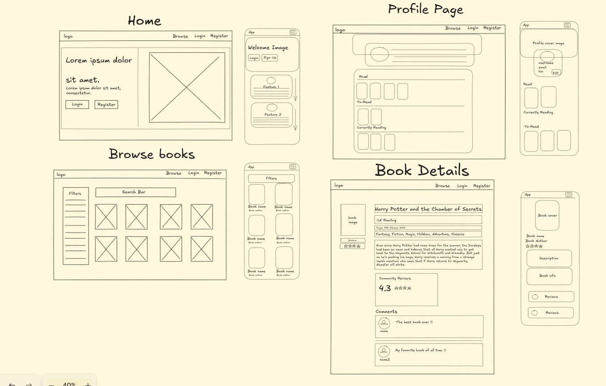

# Shelfie

## Description
Shelfie is a minimalist book catalog app inspired by Goodreads, built with Vanilla JavaScript, HTML, and CSS on the frontend, and powered by an Express.js backend with MongoDB for data storage. I intentionally chose not to use any frontend frameworks to strengthen my core JavaScript skills and gain a deeper understanding of the fundamentals. The app provides a responsive, user-friendly interface for browsing a curated collection of books

## Deployment link
https://shelfie-book-app.netlify.app/

The following credentials can be used to try the app:
* email: johndoe@gmail.com  
* password: 1234

## Project Installation
To set up the project, follow these steps:
1) Clone the project: `git clone https://github.com/didelchev/shelfie-book-app.git`
2) Go to the root directory of the project.
3) Go to the server folder and install the backend dependencies: `npm install`
4) Start the backend server: `npm start`, the server will run on http://localhost:3000
5) Go to the client folder: `cd client`
6) Install the frontend dependencies: `npm install`
7) Start the frontend server: `npm run dev`, the server will run on http://localhost:5000

## Technologies Used
* JavaScript
* Lit-html
* Express.js
* MongoDB Atlas
* CSS
* HTML

## Requirements 
* Build a full-stack application by making your own backend and your own front-end.
* Use Vanilla JS, HTML and CSS.
* Create a responsive design.
* Deploy it online so it's publicly accessible.

## Planning 
I Started the project by drawing a wireframe on Excalidraw. The app consists of the following pages:

* Login: Allows users to log in to their accounts.
* Register: Enables users to create new account.
* Browse Books: Displays a book catalog with the filter options to di
* Single Book: Shows detailed information about a specific book. Users can add books to their library by clicking the "Add to Library" button and categorize them as "Read," "Currently Reading," or "Wishlist." If a book is already in the library, the user can view its current category instead of the default "Add to Library" button.
* Profile Page: Allows logged-in users to see their profile, with their profile image, bio, their book stats. They can also view all the books they have added to a specific category (Read, Currently Reading, To-Read)

## Build Process 
1) Initial Layout – Started with the basic design using only HTML and CSS, focusing on structure and styling before adding any JavaScript.

2) Backend & Database Setup – Built the Express.js server and connected it to a MongoDB database to handle data storage and retrieval.

3) Frontend Functionality – Returned to the frontend to implement:
    * Authentication: Login and registration system
    * Catalog Page: Displayed books with filtering and search capabilities
    * Single Book Page: Showed detailed information, ratings, and comments
    * Profile Page: User-specific data and settings

4) Polish & Responsiveness – Refined the design, improved usability, and ensured the layout was fully responsive across devices.

5) Deployed the backend on vercel.com and the frontend on netlify.com

## Wins
My biggest win was successfully completing my first solo full-stack project without relying on any frontend frameworks like React, Angular, or Vue. By doing so, I filled important gaps in my JavaScript knowledge.

## Bugs

* Very slow loading when opening the app for the first time.
* Burger menu not showing on home page on mobile.

## Future Improvements
* Improve performance for large book lists.
* Add reading progress
* Edit comments
* Like comments 
